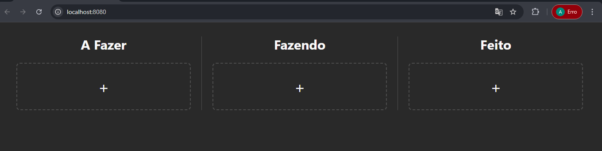
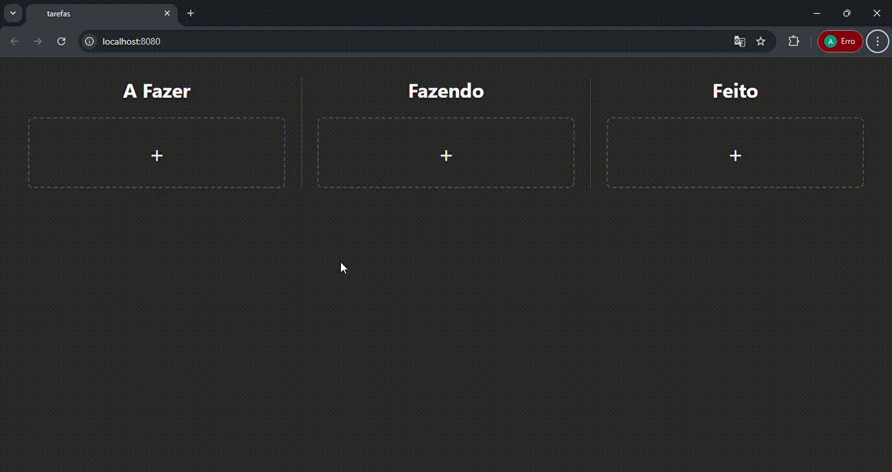

# Kanban - Gerenciador de Tarefas

Um aplicativo web de Kanban desenvolvido em React com TypeScript para gerenciar tarefas em 3 colunas: A Fazer, Fazendo e Feito. Projeto foi criado com base na [identidade visual](https://www.figma.com/file/5hI8n63ukVifZdQ7hNJ5IW/Kanban?type=design&node-id=0%3A1&mode=design&t=GS9du2LtmIzZ9EUc-1)

## Funcionalidades

- Criar novas tarefas com título, descrição, responsável e prazo
- Editar tarefas existentes
- Deletar tarefas
- Arrastar tarefas entre colunas (Drag & Drop)
- Persistência de dados (localStorage)
- Interface responsiva com Tailwind CSS

## Tecnologias Utilizadas

- **React** 18.3 - Biblioteca para UI
- **TypeScript** - Tipagem estática
- **Vite** - Ferramenta de 'build' rápida
- **Tailwind CSS** - Estilização
- **shadcn/ui** - Componentes UI

## Como Executar

### Pré-requisitos
- Node.js 18+ instalado
- npm ou yarn

### Instalação e Execução

Para instalar as dependências e rodar o projeto localmente:

```sh
# Clonar ou extrair o repositório
cd Desafio-3-2025.2-Frontend

# Instalar dependências
npm install

# Iniciar servidor de desenvolvimento (com hot-reload)
npm run dev

# Acessar em http://localhost:8080
```

## Demonstração

### Tela Vazia



### GIF de Funcionamento
Demonstração completa do projeto:



##  Estrutura do Projeto

```
src:
- pages/
  - Index.tsx        # Componente principal (Kanban)
  - NotFound.tsx     # Página 404
components
   - Coluna.tsx      # Coluna do Kanban
   - Cartao.tsx      # Card de tarefa
   - FormularioTarefa.tsx  # Formulário de criar/editar
assets
   - usuario.png     # Ícone de usuário
   - calendario.png  # Ícone de data
App.tsx              # Componente raiz
main.tsx            
```

## Principais Decisões de Implementação

### Estado com Hooks
O estado das tarefas é gerenciado em `Index.tsx` usando `useState` e passado para componentes filhos via props. Isso mantém a estrutura mais simpls do projeto.

### LocalStorage
Cada mudança no estado de tarefas é salva automaticamente no `localStorage` usando `useEffect`, permitindo que os dados persistam entre sessões.

### Drag & Drop Nativo
Implementei drag & drop usando a API nativa do HTML5 (`onDragStart`, `onDragOver`, `onDrop`), sem bibliotecas externas como `react-beautiful-dnd`.